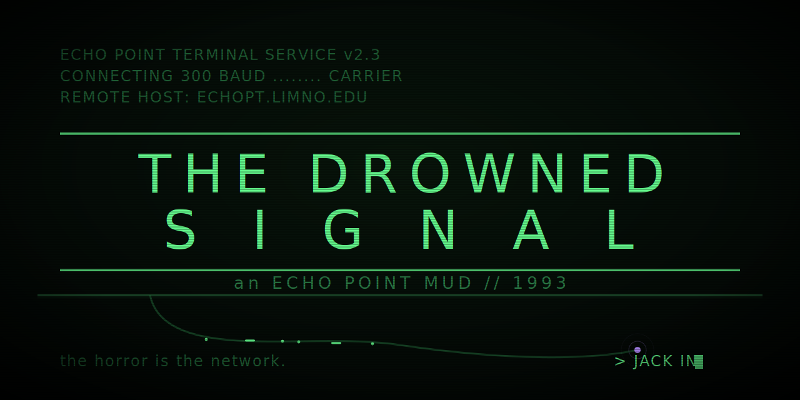

**A single-player, Lovecraftian, browser-based MUD — where the horror is the network.**

February 16th, 1993. Echo Point Limnological Research Station on Lake
Ontario went silent eleven days ago. Six staff. No mayday. Just a network
that stopped answering — then started again, transmitting nothing anyone
could read.

You are the relief network technician. The maintenance barge docks in
hours to patch the station into the mainland fiber.

Your job is about to change.

## ▸ PLAY

**[► JACK IN](https://kitapplegate.github.io/Drowned-Signal/)**

No install. No dependencies. One HTML file, any browser. Keyboard required.

## ▸ FEATURES

- Classic early-90s MUD parser — `LOOK`, `EXAMINE`, `TAKE`, and things you'll regret typing
- **Real networking puzzles**: console into a managed switch, read MAC
  tables, fix VLAN assignments, and solve a live /28 subnetting problem
- A sanity system that corrupts the terminal itself as yours declines
- Full CRT treatment: phosphor glow, scanlines, 300-baud boot sequence
- Three deaths. One survival. Read everything. *Wear the gloves.*

## ▸ FIELD NOTES

> "Don't splice into anything you can't see both ends of."

CCNA candidates: everything the switch tells you is real. Treat it
like a lab. The lake is optional.
````
